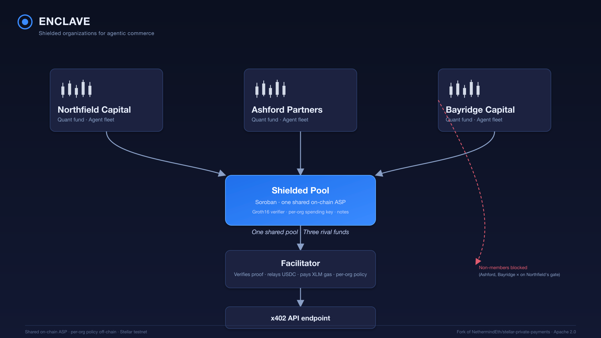

# Enclave — Shielded Organizations for Agentic Commerce

> **Status:** Proof of Concept built for the Stellar Agentic Hackathon 2026. Testnet only. Not audited. Not for production.

Enclave is a multi-tenant private treasury layer for autonomous agents on Stellar. Organizations deploy shielded treasuries inside a single shared privacy pool, their agents pay for x402 API services without leaking treasury balance or supplier relationships, and a facilitator bridges shielded proofs to public USDC settlement so existing x402 endpoints don't need to change.

## Architecture (one sentence)

**Shared on-chain ASP, per-org policy enforced off-chain.** One shared privacy pool + one shared membership set on-chain gives every organization the maximum anonymity set. Per-organization spending rules, caps, and audit trails are enforced by the facilitator off-chain. An organization is a policy over a shared membership set — not an on-chain anonymity set of its own.

Put differently: there is exactly one shared on-chain ASP for the whole pool, and Enclave layers per-org policy on top of it off-chain.

This is a deliberate architectural lock. Per-org on-chain ASPs are technically infeasible on the current pool contract (the pool hard-codes one ASP root; see `PITFALLS.md §1`). Ship-ready designs for per-org on-chain ASPs are deferred to v2 (Approach B).



## What's in the box

- **@enclave/treasury** — CLI for org admins: bootstrap org, derive shared org spending key, deposit testnet USDC, enroll agent members (off-chain).
- **@enclave/agent** — Node-runnable SDK: `agent.fetch(url)` drop-in x402 client that produces shielded proofs using the shared org key.
- **@enclave/facilitator** — HTTP service: verifies shielded proofs on-chain, relays `pool.transact()` (meta-tx model, pays XLM gas from its float), settles USDC via x402.
- **@enclave/gate** — `withEnclaveGate({ orgId })` Next.js middleware: gates an HTTP endpoint by ZK membership in a given org.
- **@enclave/demo** — Next.js app hosting the gated demo endpoint.

## Quickstart

> Full setup requires Stellar CLI, Rust 1.92.0, and Node 22 LTS. The hackathon demo runs on Stellar testnet with testnet USDC. Follow the phased setup in `.planning/ROADMAP.md` — or the highlights below.

```bash
# 1. Install Rust 1.92.0 (pinned via rust-toolchain.toml)
rustup show

# 2. Build upstream contracts + circuits + prover WASM (Rust side)
make circuits-build

# 3. Install Node workspaces (facilitator, treasury, agent SDK, gate, demo)
nvm use       # reads .nvmrc (Node 22)
npm install
npm run build

# 4. Deploy upstream contracts to testnet (one-time per fork)
./scripts/deploy.sh testnet \
  --deployer <your-stellar-identity> \
  --asp-levels 10 \
  --pool-levels 10 \
  --max-deposit 1000000000 \
  --vk-file scripts/testdata/policy_test_vk.json

# 5. Smoke-test the deployed pool
scripts/smoke-test.sh

# 6. Verify upstream license hygiene
scripts/check-upstream.sh
```

## Operations

Solo-builder ops discipline during the 2026-04-10 → 2026-04-17 hackathon window. See [RUNBOOK.md](RUNBOOK.md) for the full routine.

**Daily** (until 2026-04-17):

    ./scripts/preflight.sh pool-ttl-bump

Bumps Soroban persistent TTL for `pool` + `asp_membership` + `asp_non_membership` + `verifier`. Manual discipline — no cron, no launchd. Miss a day and the demo may die silently mid-recording (Pitfall 10, 7-day retention).

**Before each recording take:**

    ./scripts/preflight.sh full-check

Runs the six OPS-01 checks (TTL, /health, float, event window, deployments liveness, REGISTRY_FROZEN=1). Exit 0 iff all pass. See [RUNBOOK.md](RUNBOOK.md) for thresholds and emergency recovery commands.

## Demo video

A ≤3-minute video demo is recorded on 2026-04-15 (rehearsal) and 2026-04-16 (final). See the DoraHacks submission for the link.

**Pre-generated proofs note (honest disclosure):** The recorded demo uses pre-generated proofs from `demo/fixtures/` rather than live proof generation during the video. This is documented honestly because live proving may exceed the video's pacing budget.

## Testnet Contracts

All four Soroban contracts are live on Stellar testnet. Source of truth: [`scripts/deployments.json`](scripts/deployments.json). Rendered by `scripts/render-contracts-table.sh`.

| Contract | Address | Stellar Expert |
|----------|---------|----------------|
| Pool (`pool`) | `CA6B2SZXWMAJIL44YNP4FPUASXHPCFXAA63UQACKX72L2RJPREWII3WD` | [View](https://stellar.expert/explorer/testnet/contract/CA6B2SZXWMAJIL44YNP4FPUASXHPCFXAA63UQACKX72L2RJPREWII3WD) |
| ASP Membership (`asp-membership`) | `CC7QVJXI2DKIM2P25M42FS4OQLAS4UAHGJKH25CJEWYHW32FF65GEQZN` | [View](https://stellar.expert/explorer/testnet/contract/CC7QVJXI2DKIM2P25M42FS4OQLAS4UAHGJKH25CJEWYHW32FF65GEQZN) |
| ASP Non-Membership (`asp-non-membership`) | `CCMC7EA5RO7NFSV4PEJR7DARQWNYPH5BR6QVN7RTYOMLHEOJK6Z5R3RF` | [View](https://stellar.expert/explorer/testnet/contract/CCMC7EA5RO7NFSV4PEJR7DARQWNYPH5BR6QVN7RTYOMLHEOJK6Z5R3RF) |
| Groth16 Verifier (`circom-groth16-verifier`) | `CBINRYR4N62W4HOI26R3ARZCJXFYTKZESVAL6LJHRNYCO6GNNUVO2DFA` | [View](https://stellar.expert/explorer/testnet/contract/CBINRYR4N62W4HOI26R3ARZCJXFYTKZESVAL6LJHRNYCO6GNNUVO2DFA) |

**Admin / deployer:** [`GBWJZZ3XSNAY3WLFNLXUZXEEYMZCYVG4TW6Z5VSASJS2TOWF7GGPPKMW`](https://stellar.expert/explorer/testnet/account/GBWJZZ3XSNAY3WLFNLXUZXEEYMZCYVG4TW6Z5VSASJS2TOWF7GGPPKMW) · TTL extended daily via `scripts/preflight.sh pool-ttl-bump` during the 2026-04-10 → 2026-04-17 hackathon window (see `.planning/phases/05-*` for the routine).

**Facilitator health:** `GET $FACILITATOR_URL/health` returns the live USDC float + gas float + last-seen pool root. Defaults to `http://localhost:3001/health` per Phase 2/5 convention. Public URL (if hosted) lands here before submission.

## Credits

Enclave is a fork of [NethermindEth/stellar-private-payments](https://github.com/NethermindEth/stellar-private-payments), originally authored by the Stellar Development Foundation and maintained by Nethermind. Copyright for the upstream code remains with its original authors. Enclave adds a new product layer (treasury, facilitator, SDK, gate, demo) on top of the upstream shielded pool + circuits + prover without modifying any upstream source.

The upstream project's original README is captured in the project history — see the [upstream repo](https://github.com/NethermindEth/stellar-private-payments) for the original "Private Payments for Stellar" narrative, architecture docs, and per-contract documentation.

**"Nethermind" is not used as a trademark in the Enclave project name, pitch, or branding.** Upstream credit is given by attribution; no affiliation, endorsement, or partnership is implied.

## License

Enclave is distributed under the same license as its upstream source: **Apache License 2.0**. See `LICENSE` at the repo root. The license file, `circuits/LICENSE`, and (if present) `NOTICE` are preserved byte-identical to upstream — enforced by `scripts/check-upstream.sh` which runs `git diff upstream/main -- LICENSE NOTICE circuits/LICENSE`.

**LGPLv3 obligation:** The `poseidon2/` crate is forked from [HorizenLabs/poseidon2](https://github.com/HorizenLabs/poseidon2) which is licensed under LGPLv3. Any redistribution of binaries linking the `poseidon2` crate must comply with LGPLv3's source-availability requirements. Enclave does not relicense, repackage, or remove LGPL notices from that crate.

This project is a **Proof of Concept**. It has not been audited and must not be used in production environments with real assets.

## Phase 0 hygiene

- `scripts/check-upstream.sh` — verifies LICENSE, NOTICE, circuits/LICENSE match upstream/main
- `.gitignore` — blocks `*.key`, `*.pem`, `.env*`, `secrets/`, `wallets/`, `deployments-local.json`, `fixtures/*.secret.*`
- Phase 0 secrets scan report: `.planning/phases/00-setup-day-1-de-risking/00-01-SECRETS-SCAN.md`
- Prover benchmark + POOL-08 null-input finding: `docs/benchmarks.md`

## Roadmap (post-hackathon, v2)

- **Approach B** — Per-org on-chain ASPs via pool-contract + circuit changes (requires CRS regeneration)
- **Approach C** — Facilitator decentralization (threshold signing, reputation)
- **Approach D** — Autonomous treasury policies (on-chain spend caps, agent key rotation)
